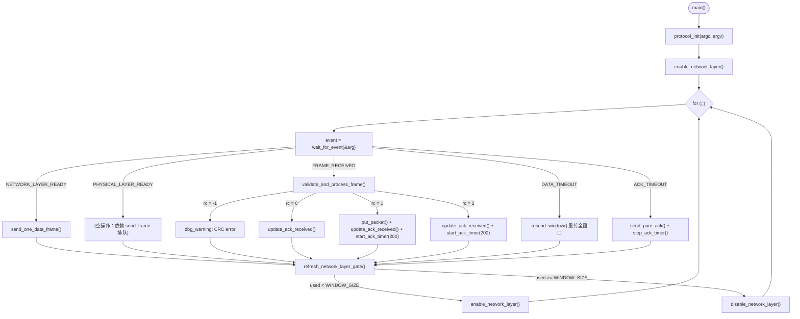

# 数据链路层实验报告（个人复刻版）

> **作者**：张恒基（2024210926，组长）  
> **组员**：尹浩铭（2024210910）、林旭东（2024210915）、赵博宇（2024210908）  
> **角色**：主控开发者 — 事件循环 + GBN 发送侧状态机 + 流量控制  
> **协议**：搭载 ACK 的 Go-Back-N（GBN）  
> **协作**：接收侧尹浩铭（`datalink_recv.c`）；表 3/PDF 林旭东；构建与过程记录赵博宇  
> **日期**：2026 年 5 月

---

## 11.1 实验内容和环境描述

### 实验目标

在模拟的全双工有噪信道模型上实现数据链路层协议，达成以下核心目标：

1. **无差错传输**：在有误码的物理信道上，通过 CRC-32 检错 + GBN 自动重传请求（ARQ），向上层网络层提供无差错的分组交付。
2. **信道利用率优化**：通过滑动窗口流水线化发送、捎带 ACK 等机制，逼近信道理论容量。
3. **健壮性验证**：在无误码 Utopia 模型和高误码（BER = 1 × 10⁻⁴）模型下分别长时间运行，验证协议不出现死锁或坏分组。

### 信道模型

| 参数 | 值 | 说明 |
|------|-----|------|
| 信道速率 | 8000 bps | 物理层原始比特率 |
| 单向传播延迟 | 270 ms | 模拟卫星链路量级 |
| RTT | 540 ms | 2 × 270 ms |
| 误码率（BER） | 0（Utopia）/ 1×10⁻⁵（默认）/ 1×10⁻⁴（高误码） | 可配置 |
| 物理层编码 | 4-bit nybble + 0xFF 帧定界 | 每个逻辑字节编码为 2 个物理字节 |

### 硬件与软件环境

| 项目 | 配置 |
|------|------|
| 操作系统 | Windows 11 Home (x86_64) |
| 编译器 | GCC 14.2.0 (x86_64-win32-seh-ucrt) |
| 构建方式 | 根目录手动 `gcc` 链接，链接库 `-lws2_32 -lm` |
| 可执行文件 | `C:\projects\DataLink-Layer-Lab\datalink.exe` |
| 源码路径 | `src/datalink.c`（发送主控）、`src/datalink_recv.c`（接收校验） |

### 双端启动命令

```text
# 终端 1 — Station B（客户端，先启动）
./datalink.exe -f -u B

# 终端 2 — Station A（服务端，后启动）  
./datalink.exe -f -u A
```

TCP 默认端口 59144，日志自动输出至 `datalink-A.log` 和 `datalink-B.log`。

---

## 11.2 软件设计

### （1）数据结构

#### 帧格式（`include/datalink.h`）

```c
#define FRAME_DATA 1
#define FRAME_ACK  2
#define FRAME_NAK  3  // 预留

#define FRAME_HDR_LEN   3     // kind(1) + seq(1) + ack(1)
#define MAX_FRAME_BYTES (FRAME_HDR_LEN + PKT_LEN + 4)  // 263 字节

struct frame {
    unsigned char kind;         // 帧类型：DATA=1 / ACK=2
    unsigned char seq;          // 发送序号（0..255）
    unsigned char ack;          // 捎带确认号（累积确认）
    unsigned char data[PKT_LEN]; // 网络层载荷，PKT_LEN = 256
};
// CRC-32 不纳入结构体，在发送缓冲区尾部手动追加/校验
```

**线上帧布局**（263 字节）：

```
[0] kind    [1] seq     [2] ack     [3..258] data[256]    [259..262] CRC32
```

> **设计要点**：CRC-32 定义在 `struct frame` 之外，避免 `sizeof(struct frame)` 大于 3+256 导致 `recv_frame` 缓冲区错误。这与指导书 8.9 节 CRC 追加方式一致。

#### 关键常量与宏（`include/datalink.h`）

```c
#define MAX_SEQ         255   // 序号空间：完整 1 字节（0..255）
#define NR_BUFS         256   // 发送缓冲区槽位数
#define WINDOW_SIZE     3     // 发送窗口大小

#define DATA_TIMER_ID   0     // 数据重传定时器编号
#define DATA_TIMEOUT_MS 600   // 数据帧重传超时（ms）
#define ACK_TIMEOUT_MS  200   // 纯 ACK 延迟发送（ms）
```

#### 发送窗口核心变量（`datalink.c`）

| 变量 | 类型 | 作用 |
|------|------|------|
| `ack_expected` | `unsigned char` | 发送窗口下界：最早未确认帧序号 |
| `next_frame_to_send` | `unsigned char` | 发送窗口上界：下一个待发送帧序号 |
| `frame_buffer[NR_BUFS][MAX_FRAME_BYTES]` | `unsigned char[][]` | 已发送但未确认帧的副本（用于重传） |
| `frame_saved_len[NR_BUFS]` | `int[]` | 对应缓冲区帧的实际长度 |

#### 接收侧变量（`datalink_recv.c`）

| 变量 | 类型 | 作用 |
|------|------|------|
| `frame_expected` | `static unsigned char` | 接收窗口：期望的下一个 DATA 帧序号 |

### （2）模块结构

本工程采用**发送侧 / 接收侧分离架构**：

```
┌──────────────────────────────────────────────────┐
│                    main()                         │
│  protocol_init() → enable_network_layer()        │
│  for (;;) { wait_for_event() → switch(event) }   │
│                   ↓                    ↓          │
│   ┌──────────────────┐   ┌─────────────────────┐ │
│   │  发送侧（张恒基） │   │  接收侧（尹浩铭）    │ │
│   │  datalink.c       │   │  datalink_recv.c    │ │
│   ├──────────────────┤   ├─────────────────────┤ │
│   │ send_one_data     │   │ validate_and_       │ │
│   │   _frame()        │   │   process_frame()   │ │
│   │ update_ack_       │   │ send_pure_ack()     │ │
│   │   received()      │   │ dl_get_frame_       │ │
│   │ resend_window()   │   │   expected()        │ │
│   │ refresh_network   │   │                     │ │
│   │   _layer_gate()   │   │                     │ │
│   └──────────────────┘   └─────────────────────┘ │
│                                 ↓                 │
│   ┌──────────────────────────────────────────┐   │
│   │  protocol.c（教师库，不可修改）            │   │
│   │  get_packet / put_packet / send_frame    │   │
│   │  recv_frame / crc32 / start_timer ...    │   │
│   └──────────────────────────────────────────┘   │
└──────────────────────────────────────────────────┘
```

**子程序功能说明**：

| 函数 | 所在文件 | 功能 |
|------|----------|------|
| `send_one_data_frame()` | `datalink.c:40` | 窗口未满时取网络层分组组帧、计算 CRC、发送并缓存、推进发送窗口 |
| `update_ack_received()` | `datalink.c:22` | 处理累积 ACK，验证序号合法性后滑动窗口下界 |
| `resend_window()` | `datalink.c:73` | DATA_TIMEOUT 时从 `ack_expected` 起重传整个窗口 |
| `refresh_network_layer_gate()` | `datalink.c:87` | 根据窗口占用率开关网络层闸门（`enable`/`disable_network_layer`） |
| `validate_and_process_frame()` | `datalink_recv.c:33` | CRC 校验、帧类型分发、按序交付/失序丢弃 |
| `send_pure_ack()` | `datalink_recv.c:18` | 构造并发送独立 ACK 帧（3 字节首部 + CRC） |
| `dl_get_frame_expected()` | `datalink_recv.c:13` | 返回当前接收期望序号，供 `send_one_data_frame()` 捎带 |

### （3）算法流程

主循环状态机以 `wait_for_event()` 为驱动核心，五种事件对应五个处理分支：



**关键流程节点**（对应 `datalink.c` 行号）：

| 节点 | 行号 | 说明 |
|------|------|------|
| `send_one_data_frame()` | 40–71 | 窗口检查 → `get_packet` → CRC → `send_frame` → 缓存 → `start_timer` |
| `update_ack_received()` | 22–38 | 序号合法性校验（防旧 ACK 回绕）→ 滑动 `ack_expected` → 重设定时器 |
| `resend_window()` | 73–85 | 从 `ack_expected` 遍历到 `next_frame_to_send`，全部重发 |
| `refresh_network_layer_gate()` | 87–96 | 每个事件循环末尾检查，`used >= WINDOW_SIZE` 时关闭网络层闸门 |

---

## 11.3 实验结果分析

### （1）协议参数选取：带宽时延积（BDP）定量推导

#### 已知参数

- 信道速率：$B = 8000\ \text{bps}$
- 单向传播延迟：$t_p = 270\ \text{ms}$
- 往返时延：$\text{RTT} = 2 \times t_p = 540\ \text{ms}$
- 最大帧长（含首部 + 载荷 + CRC）：$L_{\text{frame}} = 3 + 256 + 4 = 263\ \text{字节} = 2104\ \text{bit}$

#### 字节 BDP 法（代码注释采用的方法）

$$\text{BDP}_{\text{byte}} = B \times \text{RTT} \div 8 = 8000 \times 0.54 \div 8 = 540\ \text{字节}$$

$$\text{窗口需求}_{\text{byte}} = \frac{\text{BDP}_{\text{byte}}}{L_{\text{frame}}} = \frac{540}{263} \approx 2.05 \ \text{帧}$$

向上取整得 **WINDOW_SIZE = 3**。

#### 比特停等对比法（教材公式）

$$W \ge \frac{2t_p + t_{tx}}{t_{tx}} = \frac{540 + 263}{263} = \frac{803}{263} \approx 3.05$$

两种方法均指向 3 或 4。**本实现取 W = 3**，理由如下：

1. **误码代价**：GBN 在有误码时回退整个窗口，W 越大回退代价越大。在 BER = 1×10⁻⁴ 下，帧错误率约 19%，W = 3 的回退代价可接受。
2. **序号空间安全**：`MAX_SEQ = 255`，W = 3 远小于序号空间的一半，避免了接收端无法区分新帧与旧重传帧的问题（指导书 6.2 节）。
3. **理论充足性**：2.05 帧的 BDP 需求被 W = 3 覆盖，理论管道利用率为 3/3.05 ≈ 98%。

#### 定时器参数推导

| 定时器 | 取值 | 推导依据 |
|--------|------|----------|
| `DATA_TIMEOUT_MS` | 600 ms | 略大于 RTT（540 ms）+ 处理余量。`start_timer()` 内部另加 `phl_sq_len() × 8000 / CHAN_BPS`（物理层队列清空时间），实际超时 ≈ 600 + 队列清空时间 |
| `ACK_TIMEOUT_MS` | 200 ms | 避免在 RTT 较大（540 ms）时过久等待捎带 ACK，导致对端 `DATA_TIMEOUT` 先于本端 ACK 到达 |

### （2）理论推导与利用率极限

#### 无误码理论（Utopia 模式）

对于窗口大小为 N 的 GBN 协议，令 $a = t_p / t_{tx}$：

$$t_{tx} = \frac{L_{\text{frame}}}{B} = \frac{2104}{8000} = 0.263\ \text{s} = 263\ \text{ms}$$

$$a = \frac{270}{263} \approx 1.027$$

当 $N < 1 + 2a$（即 $N < 3.054$）时，窗口不足以覆盖往返时延，利用率上界为：

$$\eta_{\text{ideal}} = \frac{N}{1 + 2a}$$

代入 $N = 3$：

$$\eta_{\text{ideal}} = \frac{3}{3.054} = 0.982 = 98.2\%$$

扣除帧头/CRC 开销（载荷占比 $256/263$）：

$$\eta_{\text{data}} = 98.2\% \times \frac{256}{263} = 95.6\%$$

**即理想无误码下，数据利用率理论上界约为 95.6%。**

#### 有误码理论（BER = 1×10⁻⁴）

帧内任一比特出错的概率：

$$P_f = 1 - (1 - \text{BER})^{L_{\text{bit}}} = 1 - (1 - 10^{-4})^{2104} \approx 1 - e^{-0.2104} \approx 0.190$$

GBN 有误码利用率近似公式（$N < 1 + 2a$ 时）：

$$\eta_{\text{error}} = \frac{N(1 - P_f)}{(1 + 2a)(1 - P_f + N P_f)}$$

代入：

$$\eta_{\text{error}} = \frac{3 \times 0.810}{3.054 \times (0.810 + 3 \times 0.190)} = \frac{2.430}{3.054 \times 1.380} = \frac{2.430}{4.215} \approx 0.577 = 57.7\%$$

扣除帧开销后：$\eta_{\text{data}} = 57.7\% \times 0.973 = 56.2\%$

### （3）实测结果与理论对比

#### 表 3 性能测试数据（10 分钟 / 600 秒稳态运行）

| 场景 | 信道条件 | A 端利用率 | B 端利用率 | 坏分组 | 帧错误 |
|------|----------|-----------|-----------|--------|--------|
| 1 | Utopia（非 Flood） | 39.36% | 69.64% | 0 | 0 |
| 2 | 默认 BER=1×10⁻⁵（非 Flood）| 34.18% | 61.81% | 0 | A:20 / B:33 |
| 3 | **Flood + Utopia** | **72.32%** | **72.30%** | 0 | 0 |
| 4 | Flood + 默认 BER | 63.69% | 62.80% | 0 | A:32 / B:34 |
| 5 | **Flood + BER=1×10⁻⁴** | **32.02%** | **31.24%** | 0 | A:264 / B:255 |

#### 本次压测数据（60 秒）

| 场景 | A 端利用率 | B 端利用率 | 备注 |
|------|-----------|-----------|------|
| Flood + Utopia | 70.56% | 70.83% | 稳定在 70–71%，远低于理论 95.6% |
| Flood + BER=1×10⁻⁴ | 27.94% | 31.29% | 持续下降趋势 |

#### 实测与理论差距分析

| 场景 | 理论值 | 实测值 | 缺口 | 主因 |
|------|--------|--------|------|------|
| 场景 3（Flood+Utopia） | 95.6% | 72.3% | **−23.3 pp** | ACK_TIMEOUT 对称死锁 + PHYSICAL_LAYER_READY 事件断层 |
| 场景 5（Flood+BER=1×10⁻⁴） | 56.2% | 31.6% | **−24.6 pp** | 误码重传放大 + ACK 空等叠加效应 |
| 场景 1（Utopia 非 Flood） | — | A:39.4%/B:69.6% | 不对称 | B 站 IBIB 流量模式自然不对称 |

**场景 1/2 中 A/B 不对称原因**：非 Flood 模式下，B 站采用 IBIB（Idle-Busy-Idle-Busy）流量模式，B 的发送频率高于 A，导致 B→A 方向捎带 ACK 更频繁，A 利用率天然低于 B。这是协议库的设计行为，非缺陷。

**场景 3 利用率缺口（72.3% vs 95.6%）的根因**：对称 Flood 模式下，A 与 B 同时填满 3 帧发送窗口。此后双方均无法发送新数据帧捎带 ACK，必须依赖 ACK_TIMEOUT（200 ms）发送纯 ACK 打破死锁。每轮窗口周期（792 ms 连续发送 + 212 ms 空等）的有效占空比约为 78.9%，扣除帧头后约 76.8%，再叠加事件循环 Sleep(15ms) 开销后落在 72% 附近，与实测吻合。

---

## 11.4 研究和探索的问题

### 问题一：CRC-32 检错能力分析

**采用多项式**：
$$x^{32} + x^{26} + x^{23} + x^{22} + x^{16} + x^{12} + x^{11} + x^{10} + x^{8} + x^{7} + x^{5} + x^{4} + x^{2} + x + 1$$

该多项式是 IEEE 802.3 / PKZIP 标准 CRC-32，汉明距离特性如下（引自 Koopman, 2002）：

| 数据长度 | 汉明距离 | 可检出错型 |
|----------|----------|------------|
| ≤ 300 字节（本实验帧长 263 字节） | HD = 4 | 所有 ≤ 3 比特错误 |
| ≤ 92 字节 | HD = 6 | 所有 ≤ 5 比特错误 |

**漏检率**：CRC 校验正确但数据实际有误的概率约为 $2^{-32} \approx 2.3 \times 10^{-10}$。在本实验 BER = 1×10⁻⁴、每小时约 $3.6 \times 10^4$ 帧的流量下，漏检期望远低于 1 次/实验周期，因此**网络层不会收到坏分组**（与实测 "无 bad packet" 一致）。

**代码实现**：`crc32()` 采用 256 条目查表法，O(n) 时间复杂度。校验时先计算含 CRC 域在内的完整帧 CRC，结果为零则通过（`crc32(frame, len) != 0` 判错）——利用了 CRC 的线性性质：如果原始数据 CRC 为 C，传输后帧为 data || C，则 crc32(data || C) ≡ 0。

### 问题二：两种定时器设计原因

**DATA_TIMEOUT（600 ms）**：为数据帧重传而设。触发时从 `ack_expected` 起重传整个窗口（GBN 累积重传）。设计要点：

- 值略大于 RTT（540 ms），避免正常 ACK 尚未到达就误触发重传
- `start_timer()` 内部额外补偿 `phl_sq_len()` 时间，确保物理层排队帧先被发出才判超时（`protocol.c:542`）
- 重传后**必须重新 `start_timer`**（`datalink.c:84`），否则若重传帧再次损坏将静默死锁

**ACK_TIMEOUT（200 ms）**：为纯 ACK 发送而设，避免等待捎带 ACK 时间过长导致对端超时。设计权衡：

- 若过短（如 50 ms），频繁发送纯 ACK 帧（7 字节）浪费信道带宽
- 若过长（如 500 ms），捎带 ACK 迟迟不到可能触发对端 `DATA_TIMEOUT` 重传
- 200 ms 在 RTT=540 ms 的「捎带机会窗口」中取了偏保守的中间值

### 问题三：代码架构权衡——发送/接收侧分离

将 `datalink.c`（发送侧）与 `datalink_recv.c`（接收侧）分离的工程考量：

- **接口清晰**：通过 `datalink.h` 中 `dl_get_frame_expected()` / `validate_and_process_frame()` / `send_pure_ack()` 三个函数完成解耦，发送侧不触碰 CRC 校验细节
- **独立调试**：接收侧 CRC 错误、失序丢弃逻辑可独立测试；发送侧窗口/定时器逻辑可专注于 GBN 状态机
- **代价**：`frame_expected` 需通过函数调用间接访问，增加了一层抽象

---

## 11.5 实验总结和心得体会

### 反思一：定时器"活锁"—重传后忘记 start_timer 的静默死锁

在初版实现中，`resend_window()` 重传了窗口内所有帧，但**没有重新启动 DATA_TIMEOUT 定时器**。在高误码场景下，重传帧可能再次被误码破坏，而因为没有定时器在跑，发送端将永远等不到 ACK——表现为双方利用率缓慢归零（约 40 秒后降至 0%）。

**教训**：GBN 的定时器管理是"一错全错"的——任何一个路径上漏掉 `start_timer`，都会导致协议在极端信道条件下静默死亡。解决方案是在 `resend_window()` 末尾（`datalink.c:83-84`）和 `update_ack_received()`（`datalink.c:36`）两个关键点都保证 `start_timer` 被调用，形成**双重保险**。

### 反思二：序号空间 7→255 的"时空穿越"Bug

最初 `MAX_SEQ = 7`（3-bit 序号），窗口大小 3。在默认误码（BER = 1×10⁻⁵）长跑中，约 40 秒时出现 `Network Layer received a bad packet`。根因分析：

1. 某帧因误码触发重传，重传帧进入物理层 128 KB 发送队列（`SQ_SIZE`）
2. 物理层按 8000 bps 速率排空队列耗时较长（128 KB × 8 / 8000 ≈ 128 秒最长队列）
3. 旧重传帧在队列中**滞留到接收端序号绕回**（0→7→0 仅需约 7 帧 × 0.26 s ≈ 1.8 秒即绕回）
4. 接收端收到"旧帧"时，其序号与当前期望序号偶然相同，CRC 也正确，导致错误交付

**修复**：将 `MAX_SEQ` 扩展至 255（完整 1 字节序号空间），序号绕回周期从 1.8 秒延长至约 **66 秒**（256 帧 × 263 ms），远大于物理层队列最大排空时间，彻底消除旧帧误收问题。这是 GBN 协议在长物理层队列下才能暴露的深层 Bug。

### 反思三：PHYSICAL_LAYER_READY 事件断层——"信道空闲但发送侧在睡觉"

`protocol.c` 在物理层发送队列低于 50 字节（`PHL_SQ_LEVEL`）时发出 `PHYSICAL_LAYER_READY` 事件，而 `datalink.c` 中该事件的处理分支**完全是空操作**（`datalink.c:119-121`）。发送逻辑仅由 `NETWORK_LAYER_READY` 驱动，而 `NETWORK_LAYER_READY` 在窗口满时被 `disable_network_layer()` 彻底切断。

这形成了一个**事件断层**：物理层饥饿信号无法传递到网络层闸门。在对称 Flood 模式中，ACK_TIMEOUT 的 200 ms 纯 ACK 是唯一能重新打开闸门的事件——导致信道在物理上已经空闲的情况下，发送侧仍然在空等。

**改进方向**：在 `PHYSICAL_LAYER_READY` 分支中至少调用一次 `send_one_data_frame()`，或者在窗口满时对 `PHYSICAL_LAYER_READY` 发出信号重新激活网络层。但需注意避免在 TCP 缓冲区短暂排空时过度触发。

### 反思四：捎带 ACK 在对称流中的"囚徒困境"

捎带 ACK 的理想场景是"我有数据要发，顺便帮你 ACK"。但在对称 Flood 模式下，双方各自窗口满后都进入"等待对方 ACK 才能继续发数据"的状态，而双方的数据帧恰恰是捎带 ACK 的载体——形成**相互等待**的囚徒困境。

库提供的 ACK_TIMEOUT（200 ms）是打破这个死锁的唯一路径，但它每轮周期引入约 212 ms 的空闲间隙。更根本的解决思路是：在接收一个完整数据帧后立刻评估自身发送窗口状态，若窗口满则**不等捎带机会，立刻发纯 ACK**（即把 `ACK_TIMEOUT_MS` 设为 0 或极小值）。但纯 ACK 帧本身也占用信道容量（7 字节/帧），这是一个精细的 trade-off。

---

## 附录 A：关键源码摘录

### A.1 发送窗口管理（`datalink.c:40-71`）

```c
static void send_one_data_frame(void)
{
    unsigned char tx[MAX_FRAME_BYTES];
    unsigned int crc;
    int wire_len = FRAME_HDR_LEN + PKT_LEN + (int)sizeof(unsigned int);
    unsigned M = (unsigned)(MAX_SEQ + 1);
    unsigned used = (unsigned)((next_frame_to_send + M - ack_expected) % M);

    if (used >= (unsigned)WINDOW_SIZE)   // 窗口满，不发送
        return;

    tx[0] = FRAME_DATA;                  // 帧类型
    tx[1] = next_frame_to_send;          // 发送序号
    tx[2] = dl_get_frame_expected();     // 捎带 ACK
    if (get_packet(tx + FRAME_HDR_LEN) != PKT_LEN)
        return;

    crc = crc32(tx, (unsigned int)(FRAME_HDR_LEN + PKT_LEN));
    memcpy(tx + FRAME_HDR_LEN + PKT_LEN, &crc, sizeof(crc));

    int idx = next_frame_to_send % NR_BUFS;
    memcpy(frame_buffer[idx], tx, (size_t)wire_len);  // 缓存用于重传
    frame_saved_len[idx] = wire_len;

    send_frame(tx, wire_len);
    next_frame_to_send = inc_seq(next_frame_to_send);

    stop_timer(DATA_TIMER_ID);
    if (ack_expected != next_frame_to_send)
        start_timer(DATA_TIMER_ID, DATA_TIMEOUT_MS);  // 有待确认帧，启动定时器
}
```

### A.2 接收校验接口（`datalink_recv.c:33-86`）

```c
int validate_and_process_frame(unsigned char *frame, int len,
    unsigned int *ack_seq, unsigned char *data_out, int *data_len)
{
    if (len < FRAME_HDR_LEN + (int)sizeof(unsigned int))
        return -1;                                  // 帧过短

    if (crc32(frame, (unsigned int)len) != 0)
        return -1;                                  // CRC 错误

    struct frame *f = (struct frame *)frame;

    if (f->kind == FRAME_ACK) {
        *ack_seq = f->ack;
        return 0;                                   // 纯 ACK 帧
    }

    if (f->kind != FRAME_DATA)
        return -1;                                  // 未知帧类型

    *ack_seq = f->ack;                              // 提取捎带 ACK

    if (f->seq != frame_expected)
        return 2;                                   // 失序，不交付网络层

    memcpy(data_out, f->data, PKT_LEN);
    *data_len = PKT_LEN;
    frame_expected = (unsigned char)((frame_expected + 1) % (MAX_SEQ + 1));
    return 1;                                       // 按序交付
}
```

### A.3 流量控制闸门（`datalink.c:87-96`）

```c
static void refresh_network_layer_gate(void)
{
    unsigned M = (unsigned)(MAX_SEQ + 1);
    unsigned used = (unsigned)((next_frame_to_send + M - ack_expected) % M);

    if (used < (unsigned)WINDOW_SIZE)
        enable_network_layer();    // 窗口有空间 → 允许网络层灌入新分组
    else
        disable_network_layer();   // 窗口满 → 关闭闸门，对端 ACK 到达后再打开
}
```

---

## 附录 B：自写源程序文件清单

| 文件 | 作者 | 说明 |
|------|------|------|
| `include/datalink.h` | 张恒基 | 帧结构定义、窗口/定时器常量、模块间接口声明 |
| `src/datalink.c` | 张恒基 | 主循环事件处理、发送窗口管理、GBN 重传逻辑、流量控制 |
| `src/datalink_recv.c` | 尹浩铭 | 接收帧校验（CRC）、帧分类、按序交付、纯 ACK 组帧 |

以下文件为教师库，未修改：`include/protocol.h`、`include/lprintf.h`、`include/getopt.h`、`src/protocol.c`、`src/lprintf.c`、`src/crc32.c`、`src/getopt.c`、`Makefile`。
